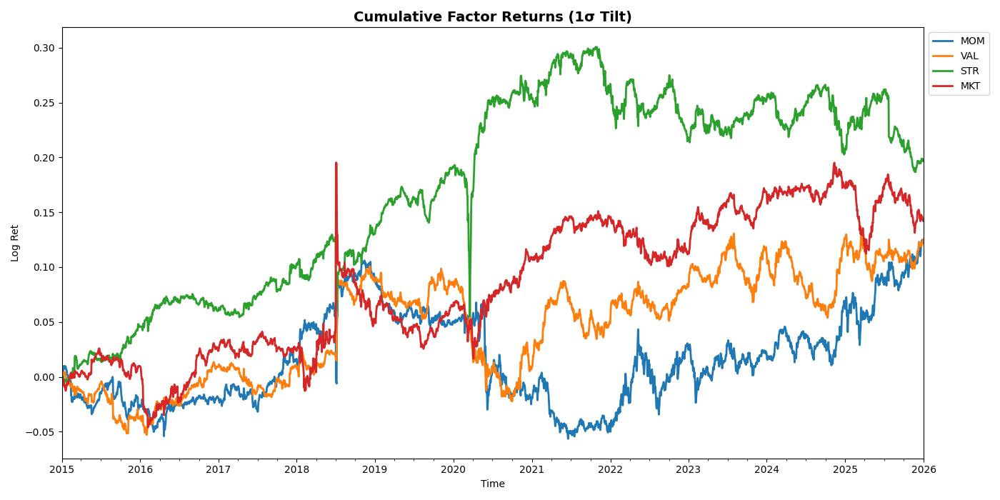
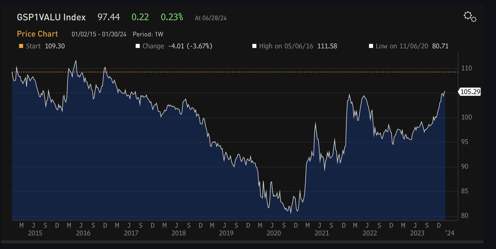
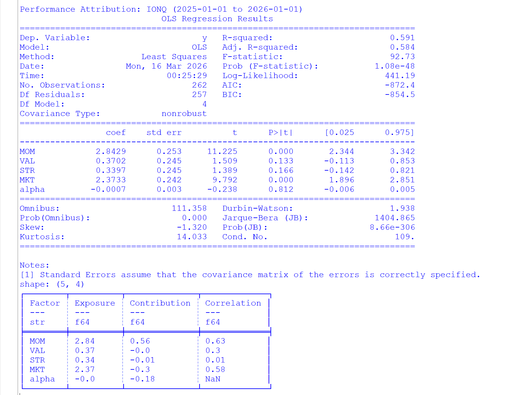
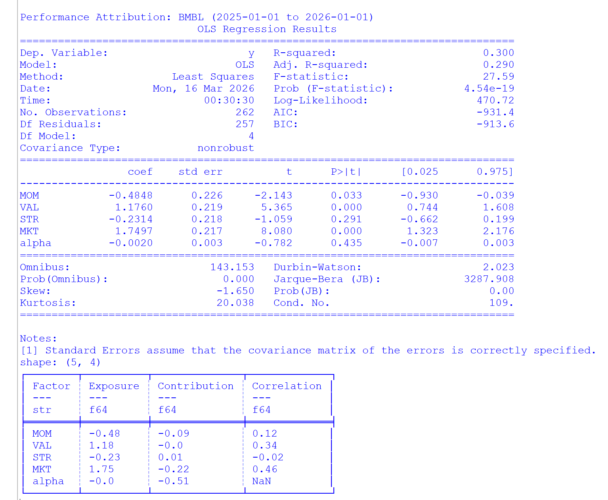
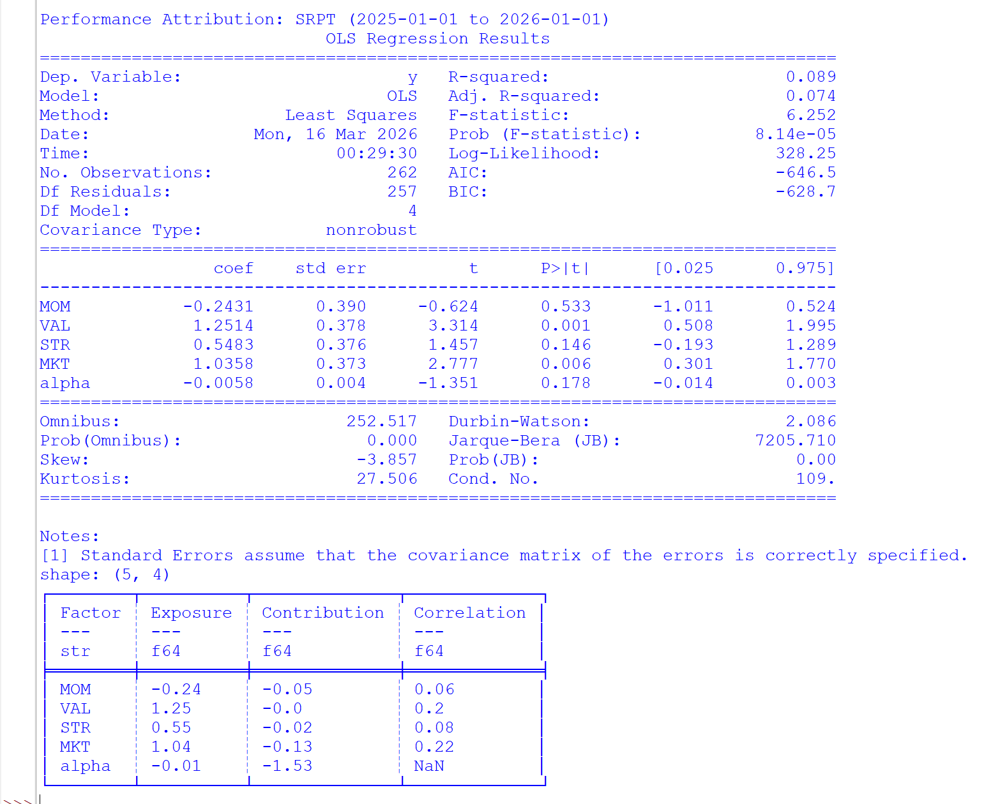

not refined

# Data Pipeline
- Price-derived factors are temporarily used as a proxy for fundamental factors (Asness, C. S., Moskowitz, T. J., & Pedersen, L. H. (2013). Value and Momentum Everywhere. The Journal of Finance)
- Polars for lazy, partitioning, batch I/O operations, versioning, compact job, schema enforcement, etc
- Regressions: Time series, cross sectional, orthogonalisation/purification, etc

# Applications
- Hedging: Long BMBL -> unintended bet on VAL and MKT -> Long X BMBL and Short Y SRPT -> isolate idio alpha
- Risk decomposition, [portfolio construction](https://github.com/soonyz06/Factor_Model_Prototype), performance attribution, scenario anaysis, MVO  (kxk instead of nxn), etc
- OLS: F = (B'B)^-1 B'R ≈ Factor-mimicking portfolios: F = WR
- Beta from OLS is ex post and Signal from factor construction is ex ante

# Factor Returns
 

- Differ quite a bit from actual values (Orange~VAL) due to only small sample size, different 'definition' of factors, i haven't scaled by MC (WLS), i prob overlooked something in the logic, etc

# Performance Attribution
IONQ  

  - IONQ's returns over the past year can be largely explained by its exposure to MOM and MKT factors (high f-stat and R^2)

BMBL  

- BMBL has high exposure to VAL, it also has low PB and PE

SRPT  

- SRPT's returns over the past year are not well explained by systematic factors
- Idiosyncratic: Death of patients, the distribution of Elevidys being temporarily halted and fear of it being pulled from the market 

