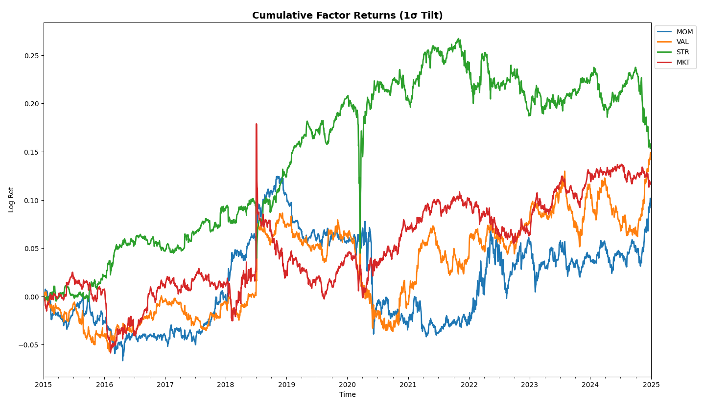

not refined

# Data Pipeline
- Price-derived factors are used as a proxy for fundamental factors (Asness, C. S., Moskowitz, T. J., & Pedersen, L. H. (2013). Value and Momentum Everywhere. The Journal of Finance)
- Will add fundamental data when i can afford it
- Polars for lazy, partitioning, batch I/O operations, versioning, compact job, schema enforcement, etc
- Winsor, znorm, neutralise, reverse winsor, regressions, etc
  
# Factor Models (R = BF + e)
  Time-series Regression
  - regression of asset returns on factor returns 
  - used in estimating realized exposures and performance attribution
    
  Cross-sectional Regression
  - regression of asset returns on exposures
  - OLS: F = (B'B)^-1 B'R ≈ Factor-mimicking portfolios: F = WR
  - used in estimating factor returns  

 Risk
  - Factor Risk Contribution = Signal exposure x std(F)
  - Factor covariance matrix for risk decomposition (Ex-Ante)
  - MVO using factor returns instead of asset returns (nxn to kxk)

# Factor Returns

- Differ quite a bit due to only small sample size, different 'definition' of factors, i haven't scaled by MC (WLS), etc
